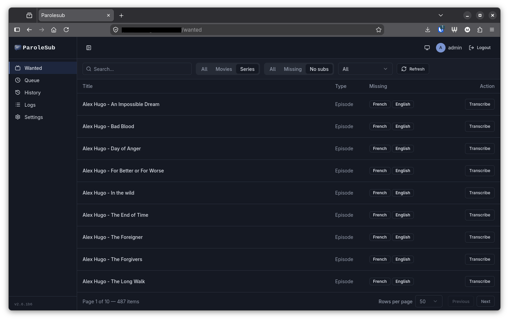

<p align="center">
  <picture>
    <source media="(prefers-color-scheme: dark)" srcset="assets/logo/parolesub-lockup-dark.png">
    
  </picture>
</p>

[](https://www.gnu.org/licenses/agpl-3.0)
[](https://github.com/RichardLitt/standard-readme)
[](https://www.python.org/downloads/)

[](https://github.com/guiand888/parolesub/actions/workflows/tests.yml)

Convert video audio to subtitles using AI transcription models.



## Table of Contents

- [Background](#background)
- [Supported Models](#supported-models)
- [Install](#install)
- [Security](#security)
- [Usage](#usage)
- [Contributing](#contributing)
- [License](#license)

## Background

ParoleSub is a self-hosted web application that automates video transcription for media libraries. It integrates with Bazarr to detect missing subtitles, queues transcription jobs, and processes them using Mistral's Voxtral Mini model. The system includes a web UI for monitoring progress, viewing history, and managing settings.

The original CLI functionality is preserved - you can still run one-off transcriptions from the command line while the web application handles automated workflows.

## Supported Models

-  Mistral — Voxtral Mini (current)
- More to come

## Install

### Container

#### Inline

One-off conversion of a single file, no persistent web app:

1. **Set API key:**
   ```bash
   echo -n "your_api_key" | podman secret create mistral_api_key -
   ```

2. **Run:**
   ```bash
   podman run --rm --userns=keep-id \
     --secret mistral_api_key,type=env,target=MISTRAL_API_KEY \
     -v ./videos:/input:ro,Z -v ./subs:/output:Z \
     parolesub:latest -i /input/video.mp4 -o /output/video.srt
   ```

#### Compose (Docker or Podman) - Recommended

For the full web application with Bazarr integration.

**Podman**, using native Podman secrets:

1. Set required secrets:
   ```bash
   echo -n "yourStrongPass!" | podman secret create admin_password -
   echo -n "your-mistral-key" | podman secret create mistral_api_key -
   ```

2. (Optional) Copy `.env.example` to `.env` to override defaults such as `ADMIN_USERNAME` — compose loads it automatically, no `export` needed.

3. Bring up the stack:
   ```bash
   podman compose up -d
   ```

4. Visit http://localhost:8080, log in as admin, then set the Bazarr URL and API key under Settings.

**Docker** is also supported, via `docker-compose.docker.yml`, a standalone variant that reads `ADMIN_PASSWORD`/`MISTRAL_API_KEY` from a plaintext `.env` file instead of Podman secrets:

```bash
cp .env.example .env   # set ADMIN_PASSWORD and MISTRAL_API_KEY
docker compose -f docker-compose.docker.yml up -d --build
```

Do not merge it with `docker-compose.yml` — run one or the other.

### Local development (`nix develop`)
```bash
git clone https://github.com/guiand888/parolesub.git
cd parolesub
nix develop   # bootstraps a .venv (gitignored) and installs deps automatically
export MISTRAL_API_KEY=your_api_key
parolesub -i video.mp4 -o subtitles.srt
```

## Security

ParoleSub does not terminate TLS itself; it expects to sit behind a reverse
proxy for any exposure beyond localhost. A ready-to-use [`Caddyfile`](Caddyfile)
is included for this — point Caddy at it for automatic Let's Encrypt HTTPS in
front of the frontend's port 8080. Set `BEHIND_TLS=true` in `.env` once a proxy
is in front, so the session cookie gets the `Secure` flag.

## Usage

ParoleSub is primarily used through its web application. The CLI commands below are optional, for one-off or advanced transcriptions.

### Web Application Workflow

1. **Setup**: Deploy using the Compose method above
2. **Configuration**: Configure Bazarr URL and API key in Settings
3. **Detection**: Bazarr integration automatically detects media missing subtitles
4. **Queue**: Items appear in the Wanted list in the web UI
5. **Process**: Click "Transcribe" to queue jobs for automatic processing
6. **Monitor**: Watch progress in the Queue page with live updates
7. **Complete**: Finished jobs appear in History with cost tracking

The Bazarr poller runs automatically and updates the Wanted list. When the "Track Items with No Subtitles" setting is enabled, it will also show items with no subtitles in any language.

### Single Video (CLI, optional)

```bash
# Basic (SRT)
podman run --rm --userns=keep-id \
  --secret mistral_api_key,type=env,target=MISTRAL_API_KEY \
  -v ./videos:/input:ro,Z -v ./subs:/output:Z \
  parolesub:latest -i /input/video.mp4 -o /output/video.srt

# VTT format
... --format vtt

# With language code
... -o /output/video.srt --language en
```

### Batch Processing (CLI, optional)

Create `parolesub.yaml`:
```yaml
jobs:
  - input: /input/video1.mp4
    output: /output/video1.srt
  - input: /input/video2.mp4
    output: /output/video2.vtt
    format: vtt
```

Run:
```bash
podman run --rm --userns=keep-id \
  --secret mistral_api_key,type=env,target=MISTRAL_API_KEY \
  -v $(pwd):/work:Z,rslave \
  parolesub:latest --config /work/parolesub.yaml
```

### Output Formats

SRT (default), VTT, SBV

### Subtitle Naming

Output files follow: `filename.language_code.format`

Examples: `movie.en.srt`, `show.s01e01.fr.vtt`

Supported language codes: en, fr, es, de, it, pt, ru, zh, ja, ko (ISO 639-1/2)

## Contributing

See [CONTRIBUTING.md](CONTRIBUTING.md) for development setup, testing, and contribution guidelines.

## License

AGPLv3 - see [LICENSE](LICENSE) file for details.
